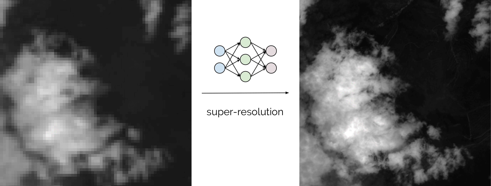

DEEP Open Catalogue: satsr
=================

[](https://jenkins.indigo-datacloud.eu/job/Pipeline-as-code/job/DEEP-OC-org/job/satsr/job/master/)

**Author/Mantainer:** [Ignacio Heredia](https://github.com/IgnacioHeredia) (CSIC)

**Project:** This work is part of the [DEEP Hybrid-DataCloud](https://deep-hybrid-datacloud.eu/) project that has received
funding from the European Union’s Horizon 2020 research and innovation programme under grant agreement No 777435.

This is a plug-and-play tool to perform super-resolution on satellite imagery. It uses Deep Learning to provide a better performing alternative to classical pansharpening (more details in the paper mentioned [below](#acknowledgments)).

Right now we are supporting super-resolution for the following satellites:

* [Sentinel 2](https://sentinel.esa.int/web/sentinel/missions/sentinel-2) 
* [Landsat 8](https://landsat.gsfc.nasa.gov/landsat-8/)
* [VIIRS](https://ncc.nesdis.noaa.gov/VIIRS/)
* [MODIS](https://terra.nasa.gov/about/terra-instruments/modis)

More information on the satellites and processing levels that are supported can be found [here](./reports/additional_notes.md) along with some [demo images](./reports/figures) of the super-resolutions performed in non-training data. 
If you want to perform super-resolution on another satellite, go to the [training section](#train-other-satellites) to see how you can easily add support for additional satellites. We are happy to accept PRs! :rocket:

You can find more information about it in the [DEEP Marketplace](https://marketplace.deep-hybrid-datacloud.eu/).




## Installing this module

### Local installation

**Requirements**
 
- It is a requirement to have [Tensorflow>=1.12.0 installed](https://www.tensorflow.org/install/pip) (either in gpu or cpu mode). 
This is not listed in the `requirements.txt` as it [breaks GPU support](https://github.com/tensorflow/tensorflow/issues/7166).
- This package needs the `GDAL` library (version >2.4.1). You can either install it with `conda` (with `conda install gdal`) or install it
with `pip` after having installed some additional external libraries. You can install those libraries in Linux with:

    ```bash
    sudo add-apt-repository -y ppa:ubuntugis/ubuntugis-unstable
    sudo apt update
    sudo apt install -y gdal-bin python-gdal python3-gdal
    ```
    
- This project has been tested in Ubuntu 18.04 with Python 3.6.5. Further package requirements are described in the `requirements.txt` file.

To start using this framework run:

```bash
git clone https://github.com/deephdc/satsr
cd satsr
pip install -e .
```

To use this module with an API you have to install the [DEEPaaS](https://github.com/indigo-dc/DEEPaaS)
package (temporarily, until `1.0` launching, you will have to use the `test-args` branch):

```bash
git clone -b test-args https://github.com/indigo-dc/deepaas
cd deepaas
pip install -e .
```

and run `deepaas-run --listen-ip 0.0.0.0`. Now open http://0.0.0.0:5000/ and look for the methods belonging to the `satsr` module.

### Docker installation

We have also prepared a ready-to-use [Docker container](https://github.com/deephdc/DEEP-OC-satsr) to run this module. To run it:

```bash
docker search deephdc
docker run -ti -p 5000:5000 deephdc/deep-oc-satsr
```

Now open http://0.0.0.0:5000/ and look for the methods belonging to the `satsr` module.


## Train other satellites

If you have images from a satellite that is not currently supported you can easily add support for your satellite:

*  Go to `./satsr/satellites` and create a `mynewsat.py` file. This file should contains basic information like resolutions, bands names and functions for opening the bands. Check the `./satsr/main_sat.py` for a reference on what parameters and functions have to be defined.
* *Optional:* You can also create another file like  `mynewsat_download.py` to support downloading data directly with Python (see `./satsr/data_download.py`).
* Link you newly created files with the satellite names by modifying the file `./satsr/main_sat.py`.
* Download training data (you can use the file `./satsr/data_download.py` for convenience).
* Create in `./data/dataset_files` a `train.txt` file with the tile names of the folders you want to train with. You can also create a `val.txt` if you want to use validation during training.
* Run the `TRAIN` method in the DEEPaaS API with your training configuration. You can monitor the progress of the training using [Tensorboard](https://github.com/tensorflow/tensorboard) by going to http://0.0.0.0:6006/ . 
* Rename the output timestamped folder in `./models` to something like `mynewsat_model_*m`.

Now you proceed to the next section to use you newly trained model to perfom super-resolution. If you are happy with the performance of your model we accept PRs to add it to the catalogue! In the near future we'll be happy to add support for additional Lansat and Sentinel missions, along with additional processing levels for satellites that are already supported, as well as any other satellite imagery in the public domain like [ASTER](https://terra.nasa.gov/about/terra-instruments/aster) or [MeteoSat](https://www.eumetsat.int/website/home/Satellites/CurrentSatellites/Meteosat/index.html).


## Perform super-resolution

There are two possible ways to use the `PREDICT` method from the DEEPaaS API:

* supply to the `data` argument a path  pointing to a compressed file (`zip` or tarball) containing your satellite tile.
* supply to the `url` argument an online url  of a compressed file (`zip` or tarball) containing your satellite tile.
Here is an [example](https://cephrgw01.ifca.es:8080/swift/v1/satellite_samples/S2A_MSIL2A_20190123T040041_N0211_R004_T48UXF_20190123T061251.SAFE.zip) of such an url for the Sentinel-2 L2A that you can use for testing purposes. You can find other sample url for other satellites [here](./reports/additional_notes.md).


## Acknowledgments

The code in this project is based on the [original repo](https://github.com/lanha/DSen2) by [Charis Lanaras](https://github.com/lanha) of the paper
[Super-Resolution of Sentinel-2 Images: Learning a Globally Applicable Deep Neural Network](https://arxiv.org/abs/1803.04271).

The main changes with respect to the original repo are that:

* most of the code has been either rewritten, restructured or cleaned up for better modularity, in order to make it plug-and-playable with
  other satellites (like LandSat).
* the code has been packaged into an installable Python package.
* it has been made compatible with the [DEEPaaS API](http://docs.deep-hybrid-datacloud.eu/en/latest/user/overview/api.html).
* some minor bugs have been corrected (and contributed back into the original repo in [#5](https://github.com/lanha/DSen2/pull/5) and [#6](https://github.com/lanha/DSen2/issues/6)).

If you consider this project to be useful, please consider citing the [original paper](https://arxiv.org/abs/1803.04271):

```
@article{lanaras2018super,
  title={Super-Resolution of Sentinel-2 Images: Learning a Globally Applicable Deep Neural Network},
  author={Lanaras, Charis and Bioucas-Dias, Jos{\'e} and Galliani, Silvano and Baltsavias, Emmanuel and Schindler, Konrad},
  journal={arXiv preprint arXiv:1803.04271},
  year={2018}
}
```
